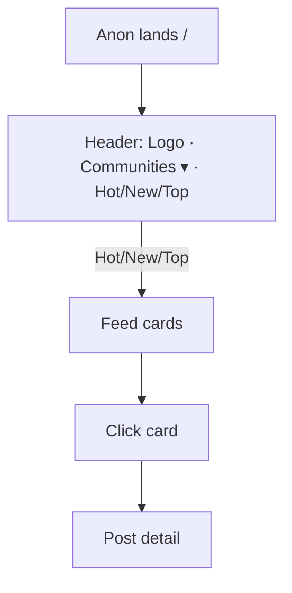
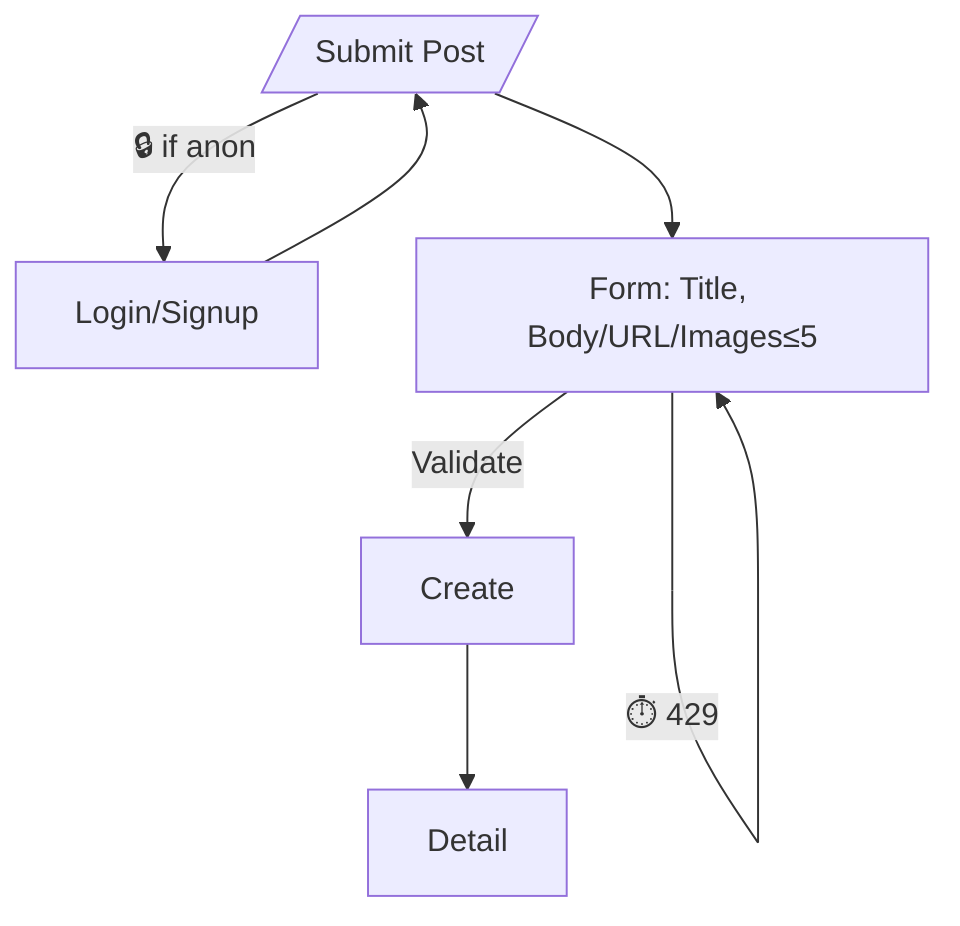
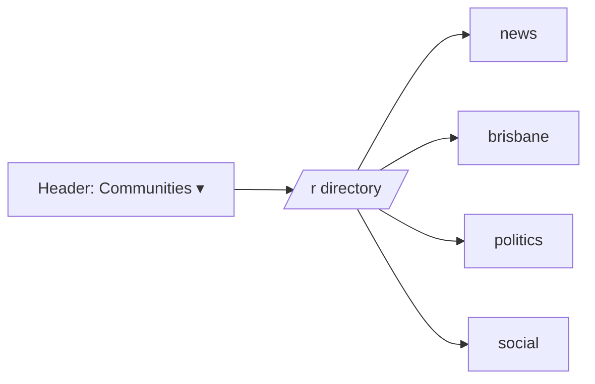

Change control: If flows change, update this file in the same PR.

# SureJan V2 — UI Flow Map

## Legend
Start → Step (screen/state) → Exit; auth gates marked 🔒; rate-limit 429 marked ⏱️.

## Flow A — Landing → Browse → Detail

**Entry:** `/`
**Screens:** Header, Feed (`.post-card`), Detail
**Exit:** Back to feed
**Selectors:** `data-testid="header-bar"`, `id="sort-tabs"`, `data-testid="post-card"`
**Accept:** `/` 200; at least one `.post-card` or empty-state.

## Flow B — Submit (Text | Link | Images≤5)



**Validation:** title ≤300; images ≤5, each ≤4MB.
**Selectors:** `data-testid="submit-form"`, `data-testid="sidebar-submit"`

## Flow C — Top + Time filter

```mermaid
flowchart LR
  T[Top tab] --> Chips{t: 24h | 7d | all}
  Chips --> Feed
```

**Rule:** default `sort=hot`; `sort=top` with `t` unset → `t=all`; ignore `t` otherwise.

## Flow D — Communities



## Flow E — Safety & Moderation

* Consent gates for embeds (YouTube-nocookie/Rumble/X); no third-party JS pre-consent.
* Actions: Remove(soft), Lock, Slowmode(manual), Domain-throttle(−50%, 7d).
* Author self-delete ≤15m: hard if no comments; else "[deleted] by author."

## Empty/Error/Permission (exact copy)

* “No posts yet.” · “Nothing here yet.” · “Something went wrong.” · “You need to sign in.”

