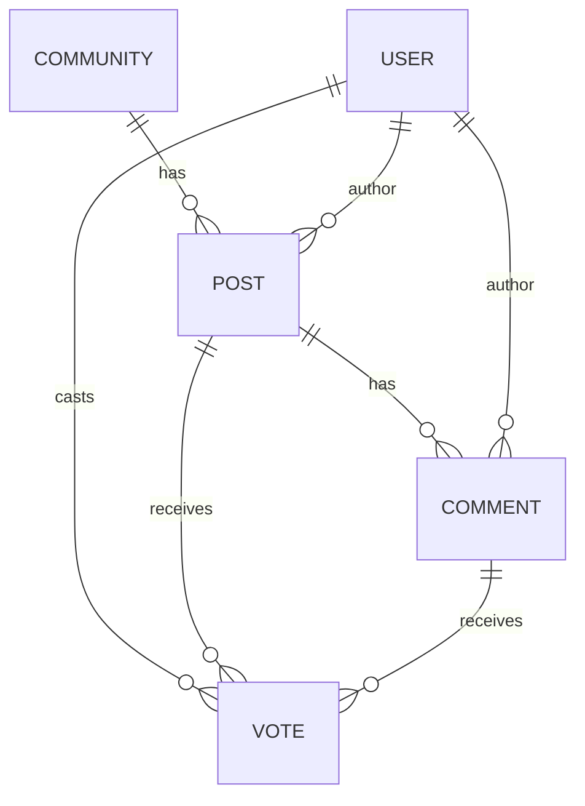

# Data Model (ERD - simplified)

Key fields:

Community(slug unique)

Post(community_id, author_id, slug unique within community)

Comment(post_id, author_id, parent_id nullable)

Vote(user_id, target_type, target_id, value ∈ {-1,0,1}), unique (user,target)

