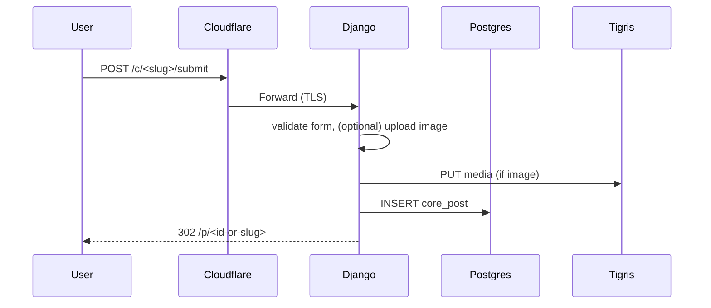

# Flow — Create Post

```mermaid
sequenceDiagram
  participant U as User
  participant W as Cloudflare
  participant A as Django
  participant DB as Postgres
  participant S as Tigris

  U->>W: POST /c/<slug>/submit
  W->>A: Forward (TLS)
  A->>A: validate form, (optional) upload image
  A->>S: PUT media (if image)
  A->>DB: INSERT core_post
  A-->>U: 302 /p/<id-or-slug>
```

Side effects: media stored under MEDIA_URL; AstroShield score updated lazily/on render.
Failures: invalid input → form errors; media failure → reject, no DB write.

